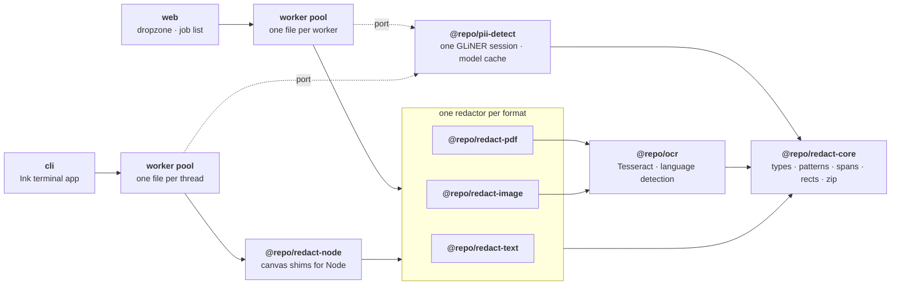

<div align="center">
  <picture>
    <source media="(prefers-color-scheme: dark)" srcset="./assets/localveil-logo-dark.svg">
    
  </picture>
  <br />
  <br />
</div>

localveil blacks out personal data in your files without uploading them. Drop in text, a PDF, or a photo of a document, and a named-entity model finds the names, emails, phone numbers, addresses, dates, account numbers and secrets, then paints over them. The model runs in a Web Worker on your own machine, the files never leave the tab, and the result comes back as a ZIP.

There is no account and no server. Once the model is cached, the page works offline. The same pipeline runs in a terminal through the CLI.

**At a glance**

- **What it is:** an app that redacts personal data from files locally, in the browser or the terminal.
- **What it takes:** plain text, Markdown, CSV, JSON, logs, PDFs, and images, in English, Portuguese or Spanish.
- **What it gives back:** the same files with the personal data covered, in a ZIP.
- **Where it runs:** entirely in the tab or in your shell. Nothing is uploaded. The only network traffic is the detection weights, fetched once, and a Tesseract language file the first time something scanned is read in a given language.

## Quickstart

```bash
pnpm install
pnpm dev --filter=web
```

Open `http://localhost:5173` and drop a file on the page.

The first run downloads the detection model, which is large and takes a while. It is fetched as six ranges at a time and each one is written to browser storage as it lands, so a refresh part way through picks up the ranges it is missing rather than starting again. Every run after that loads from cache in a few seconds.

For the terminal:

```bash
pnpm --filter cli start                    # browse and pick files
pnpm --filter cli start scan.pdf           # or name them up front
pnpm --filter cli start --lang pt scan.pdf # skip the language guessing
pnpm --filter cli start --jobs 2 *.pdf     # cap how many files run at once
```

The CLI writes `localveil.zip` into the working directory and keeps its own copy of the model under `~/.cache/localveil/models`. Without `--jobs` it runs half the core count, up to four files at once.

## What gets covered

The model tags eight kinds of personal data.

| Label             | Example                    |
| ----------------- | -------------------------- |
| `private_person`  | Maria Garcia               |
| `private_email`   | maria.garcia@example.com   |
| `private_phone`   | 555-0181                   |
| `private_address` | 42 Oak Street, Springfield |
| `private_date`    | 14 March 2024              |
| `private_url`     | a personal profile link    |
| `account_number`  | an IBAN or a card number   |
| `secret`          | an API key or password     |

Three things put a box on the page: a named-entity model, a pattern layer beneath it for numbers that carry their own arithmetic, and a repeat pass over the whole document. All three are described in [Models](#models).

A name the model tags once gets covered everywhere else it appears in the same document, including on pages it was never tagged on. A model that catches a full name in one sentence will often walk past the bare first name two lines down.

## Models

Two models run here, and neither is bundled. Both are downloaded on first use and cached from then on.

### Detection

Spans come from `gliner_multi_pii-v1`, a GLiNER model whose training languages include Portuguese and whose label set was built for exactly this: CPF, CNPJ and driver's licence numbers are things it was trained to recognise, not things it has to guess at.

The weights are the ONNX export of that model, [`onnx-community/gliner_multi_pii-v1`](https://huggingface.co/onnx-community/gliner_multi_pii-v1), pinned to one commit rather than tracked on `main`. Unpinned, a download resumed across an update splices bytes from two revisions into a single file, and the cache key never moves when the model does. The tokenizer beside it loads through `@huggingface/transformers` at the same commit.

One export, `model_q4.onnx`, is used in both the browser and the CLI: 4-bit weights with activations left in fp32. The dynamic-int8 export is a third of the size and scores correctly on native CPU, but it collapses on the browser's wasm integer kernels, where a name scoring 0.999 natively came back at 0.17. The fp16-activation exports either cannot create a session at all, because the model's LSTM has no fp16 CPU kernel, or crush the person head on WebGPU. Carrying one file also means the terminal and the tab cannot disagree about a document, and it makes the WebGPU-to-wasm fallback a cache hit rather than a second download.

### Where the model runs

In the browser, `onnxruntime-web` takes WebGPU when `navigator.gpu` yields an adapter and wasm when it does not. In the CLI, `onnxruntime-node` runs on native CPU and already spreads one inference across every core.

Either way there is exactly one session. The browser keeps it in a worker of its own, the CLI on its main thread, and the workers redacting files reach it over a `MessagePort` instead of loading their own copy. Nearly a gigabyte of weights per worker is not affordable; a port is.

### How text reaches it

GLiNER classifies against label strings handed to it at inference time, so the eight labels above are asked for as 24 prompts: `person`, `username`, `cpf`, `iban`, `driver's license number`, `password` and the rest. The wording is the model card's own, because an in-distribution string scores higher than a synonym, and the list is capped at 25 because that is how many types the model was trained to take in one pass.

| Setting      | Value     | Why                                                                             |
| ------------ | --------- | ------------------------------------------------------------------------------- |
| Chunk size   | 280 words | Trained at 384 words per example; the rest is headroom for the label prompts    |
| Overlap      | 24 words  | An entity split across a boundary is still seen whole by one chunk or the other |
| Longest span | 12 words  | The model's own `gliner_config.json` says so                                    |
| Score floor  | 0.35      | A false span costs an unneeded box, a missed one leaks an identity              |

Chunks are measured in words rather than characters because the model's context is a word count. A character budget silently overshoots it on short-word text, and whatever falls off the end is personal data nobody scanned. Each chunk comes back with its own spans, overlapping ones are suppressed, and the rest are merged into a single set of ranges over the original text.

Lines in capitals go through twice. Named-entity models lean on capitalisation so heavily that recall collapses without it: a shouted invoice header went undetected at every threshold, while the same text in title case was tagged at once. Only lines carrying two runs of capitals in a row are retried, since one alone is an acronym far more often than a name, and `INFO` on every line of a log would send the whole file through again.

### The pattern layer

Beneath the model, a pattern pass catches the numbers that can be checked rather than guessed at. It runs on every document.

| Matched            | Kept only if                                                                                       |
| ------------------ | -------------------------------------------------------------------------------------------------- |
| CPF, CNPJ          | the check digits agree                                                                             |
| IBAN               | mod-97 agrees                                                                                      |
| Card numbers       | Luhn agrees                                                                                        |
| RG, CNH, CEP       | the number sits beside the label a Brazilian document prints, and only the number is covered       |
| `dd/mm/yyyy` dates | the day and the month are in range                                                                 |
| Phone numbers      | a country code, brackets or a hyphen is there, and the match is not a span of years like 2019-2024 |
| Email addresses    | it has the shape of an address                                                                     |

So an invoice number that merely looks like a CPF is left alone, and a licence keeps the word `RG` readable next to the blacked-out number.

### Recognition

Anything scanned goes through `tesseract.js`, whose `eng`, `por` and `spa` language files are fetched the first time each is needed and whose worker per language is then kept and reused.

Confidence is read per word rather than per page, because a page average on anything security-printed is a mean over two populations: a driving licence measured 244 words with 56 of them above 90, and a page average of 46 that would have vetoed all of it. Words scoring under 60 are dropped, and a page that loses more than a quarter of its words that way comes back untouched with a warning rather than covered in guesses.

Language detection is not a model. It scores stopword frequency across the three supported languages, written without accents because the English pass drops most of them, and the lists include the field labels identity documents print.

### Reading documents

`pdfjs-dist` renders the pages, `pdf-lib` writes the redacted document back out, and `fflate` packs the result. A PDF's own text layer is read only to sample a language; the word boxes that decide where the paint lands come from recognition instead, for the reasons under [How a file is redacted](#how-a-file-is-redacted).

## Formats

| Input                                                      | How it is read                         | What comes back                                                                         |
| ---------------------------------------------------------- | -------------------------------------- | --------------------------------------------------------------------------------------- |
| `.txt` `.md` `.csv` `.json` `.log`                         | Read as text                           | The same file with covered runs replaced by `█`                                         |
| `.pdf`                                                     | Rendered, then recognised page by page | An image-per-page PDF with a searchable text layer rebuilt from the words that survived |
| `.png` `.jpg` `.webp` `.gif` `.bmp` `.tif` `.avif` `.heic` | Recognised with OCR                    | The same image with black rectangles painted on                                         |

A redacted PDF is rasterised rather than annotated. Drawing boxes over live text leaves the words in the file for anyone to copy out, which is not redaction. Rasterising costs the original text layer, so one is rebuilt from the recognised words that were not covered, and the output stays searchable.

## Privacy

- **Files stay in the tab:** the app reads them with `FileReader`, processes them in a Web Worker, and writes them back through `Blob`. No `fetch` anywhere touches them.
- **The only requests are the models:** the detection weights come from Hugging Face on first use, pinned to one revision, and the Tesseract language file for `eng`, `por` or `spa` is fetched the first time something scanned is read in that language. Both stay cached, and after that the page works with the network off. When a release changes the model, the superseded weights are deleted from the cache rather than left to sit there.
- **Nothing is stored server-side** because there is no server. The app is a static bundle.
- **Language starts from the browser:** the interface follows `navigator.languages` across English, Portuguese and Spanish, and a picker in the corner overrides it. That choice is the only thing the app keeps in `localStorage`, and it is a language tag, not your data.

`vercel.json` sends `Cross-Origin-Opener-Policy: same-origin` and `Cross-Origin-Embedder-Policy: require-corp` so the page is cross-origin isolated, which is what lets ONNX Runtime use `SharedArrayBuffer` and multithreaded wasm. The dev server sends the same pair.

## Architecture



`@repo/redact-core` owns the shared vocabulary: what a span is, the checksum patterns, how spans become rectangles, and how the ZIP is built. Every redactor implements the same `Redactor` shape, so the worker resolves one from the file and knows nothing else about it. Adding a format means adding a package, not editing the worker. The CLI reuses the same redactors through `@repo/redact-node`, which supplies the canvas globals a browser would have provided.

Files run side by side, four at most. Each worker holds pdf.js, a Tesseract worker per language and page-sized canvases, so a pool of one worker per core, which is what `workerpool` does left alone, runs a laptop out of memory. The browser sizes its pool from `hardwareConcurrency` and `deviceMemory`, holding two cores back for the model and the page itself; the CLI takes half the core count, since `onnxruntime-node` already spreads a single inference across all of them. The weights are not part of that arithmetic: one session is loaded once and served to every worker over a port, which is what makes running files in parallel affordable at all.

## Packages

| Package              | Purpose                                                                                                                         |
| -------------------- | ------------------------------------------------------------------------------------------------------------------------------- |
| `@repo/redact-core`  | Types, checksum patterns, span merging, span-to-rectangle mapping, repeat matching, ZIP building.                               |
| `@repo/pii-detect`   | GLiNER span detection over `gliner_multi_pii-v1`, the entity prompts, and the resumable model cache.                            |
| `@repo/ocr`          | Tesseract wrapper returning word boxes, plus stopword language detection across en / pt / es.                                   |
| `@repo/redact-text`  | Redactor for text formats. Masks with `█` and keeps line breaks intact.                                                         |
| `@repo/redact-pdf`   | Redactor for PDFs. Renders, recognises, paints, and rebuilds the document.                                                      |
| `@repo/redact-image` | Redactor for images. Recognises, paints, and re-encodes.                                                                        |
| `@repo/redact-node`  | Runs the redactors under Node: skia-backed canvas globals and file reading for the CLI.                                         |
| `@repo/i18n`         | Typed message catalogues for English, Portuguese and Spanish.                                                                   |
| `@repo/ui`           | Shared components: dropzone, attachment, progress, select, checkbox, collapsible, scroll area, skeleton, button, card, toaster. |

The apps are `web`, the browser app, and `cli`, the Ink terminal app. `@repo/typescript-config` and `@repo/config-vitest` hold the shared tooling config.

## How a file is redacted

<details>
<summary><b>Text</b>: read, detect, mask</summary>

The file is read as a string, chunked by words with an overlap so an entity split across a boundary is still seen whole, and each chunk goes to the model. Spans come back as character ranges, get merged, and each covered grapheme becomes `█`, so an emoji or an accented letter takes one block rather than two.

Line breaks inside a covered range survive. A span that runs off the end of one line would otherwise weld two rows of a log or a CSV together.

A `.csv` or a `.json` gets a second layer beneath the model, in the same spirit as the pattern layer: a column headed `email` guarantees every cell under it is an email, and a key named `cpf` guarantees the same about its value. The model still reads the whole file, and the structural layer only adds to what it found. Field names are matched with case, separators and accents folded away, so `Nome_Completo`, `nome completo` and `nomeCompleto` are one name. Generic names like `id`, `date` and `data` map to nothing, and so does a bare `city`, which the model does not cover in prose either.

The output is still the original string with runs replaced, never a reserialised document. A reserialised JSON is not your file.

</details>

<details>
<summary><b>PDF</b>: render, recognise, paint, rebuild</summary>

Each page is rendered at twice its point size onto an `OffscreenCanvas`, then recognised. Word boxes come from the recognised page rather than the PDF's own text layer: that layer gives runs, not words, and splitting a run's box by character count drifts by a whole character on a proportional font, which leaves the first letter of a name showing.

Every page is read before any page is painted, so a name that only gets tagged on the last page is still covered on the first. Pages are rendered a second time for painting rather than held in memory, because a hundred A4 canvases is most of a gigabyte.

The output embeds each painted page as an image and redraws the surviving words as invisible text, so the file stays searchable.

</details>

<details>
<summary><b>Images</b>: recognise, paint, re-encode</summary>

Recognition gives word boxes, those feed the same span-to-rectangle mapping the PDF path uses, and the rectangles get filled on a canvas. The result goes back out as the input's own type, or PNG for anything the encoder will not take.

</details>

<details>
<summary><b>Language</b>: detected, or told</summary>

A PDF with a usable text layer gets sampled directly, then recognised once in whatever language that text is written in. An image has no text until something reads it, so it goes through English first, the language comes from that pass, and a second pass runs only when the answer is not English.

Detection scores stopword frequency across the three supported languages, written without accents because the English probe drops most of them. The lists include the field labels identity documents print, because an ID card carries almost no prose to vote with: on a Brazilian licence, the evidence is words like `nome` and `filiação` and the `da` in the holder's name.

When you already know the answer, say so: the picker beside the dropzone and `--lang` on the CLI skip the guessing entirely, which matters most on exactly those documents.

</details>

<details>
<summary><b>Unreadable pages</b>: left alone, with a warning</summary>

A page whose fonts do not resolve renders as a wall of boxes. Recognisers read that as gibberish, and a detection model will confidently tag a long run of it as somebody's name, which paints a black rectangle over every line.

Under a confidence floor localveil looks for nothing. The page comes back untouched and carries a warning, so you can see it was unreadable and go and check it yourself.

</details>

<details>
<summary><b>The result</b>: read back and checked</summary>

Every finished file goes back through the detector once more, over what is left showing: the masked string for text, and the words no rectangle covers for a PDF or an image. Anything the model still recognises there raises a warning.

This catches painting and plumbing, not detection. A rectangle that lands a few pixels short, a word written back into a PDF's searchable layer that should have been dropped, a span whose coordinates came out reversed: those produce a file that looks redacted and is not, and nothing else in the pipeline would notice. What it cannot catch is a name the model walked past on the way in, because the same model reads the output.

</details>

## Stack

- **App:** React 19 + Vite 8, Tailwind CSS 4, shadcn-style components over Base UI, motion for the few animations, zustand for job state, sonner for toasts.
- **CLI:** Ink 7 run through `tsx`, with `@napi-rs/canvas` standing in for the browser's drawing surfaces.
- **Parallelism:** `workerpool` in both apps, one file per worker, with the detection session shared over a `MessagePort`.
- **Detection:** GLiNER (`gliner_multi_pii-v1`, ONNX, `model_q4.onnx`) on ONNX Runtime: `onnxruntime-web` with WebGPU and a wasm fallback in the browser, `onnxruntime-node` on native CPU in the CLI. The tokenizer loads through `@huggingface/transformers`.
- **Documents:** `pdfjs-dist` for rendering, `pdf-lib` for rebuilding, `tesseract.js` for recognition, `fflate` for the ZIP.
- **Build:** Turborepo + pnpm workspaces.
- **Linting / formatting:** oxlint + oxfmt, run over staged files by husky and lint-staged, with `fallow` for dead exports and duplication.
- **Testing:** Vitest on jsdom, Testing Library for components, `ink-testing-library` for the terminal app, `@vitest/coverage-v8` for coverage. About 500 unit and component tests.

## Setup

### Prerequisites

- **Node.js 24** (`nvm install 24 && nvm use 24`)
- **pnpm 11** (`npm install -g pnpm@11`)

### 1. Install dependencies

```bash
pnpm install
```

### 2. Run the app

```bash
pnpm dev --filter=web
```

The dev server sends the cross-origin isolation headers the model needs, so run it through `pnpm dev` rather than serving `apps/web` some other way.

### 3. Try it

`fixtures/` holds one document per accepted format, each carrying the same invented people, so you can see what the output looks like without reaching for anything real.

## Scripts

| Command              | Description                                |
| -------------------- | ------------------------------------------ |
| `pnpm dev`           | Start the app in development mode.         |
| `pnpm build`         | Build every package and the app.           |
| `pnpm test`          | Run tests across the monorepo.             |
| `pnpm test:coverage` | Run tests with coverage.                   |
| `pnpm lint`          | Run oxlint.                                |
| `pnpm format`        | Format with oxfmt.                         |
| `pnpm format:check`  | Check formatting without writing.          |
| `pnpm typecheck`     | Run TypeScript checks across the monorepo. |
| `pnpm clean`         | Clean all build artifacts.                 |
| `pnpm fallow:dead`   | Find unused exports.                       |

## Limits

- **The model misses things.** It is a statistical tagger rather than a rule set, so it sometimes walks past a name it should have caught. Read the output before you send it anywhere.
- **Recognition sets the ceiling on scanned input.** A blurry photo or a PDF with broken fonts yields text nothing can redact, and the app says so rather than guessing.
- **A redacted PDF is images.** The text layer is rebuilt from recognised words, so it is searchable but not identical to the original, and the file is larger.
- **The first run is a large download.** Once, resumable, and fetched several ranges at a time. The browser and the terminal run the same 4-bit weights, so they redact a document the same way, and the smaller exports are unusable for the reasons under [Models](#models).
