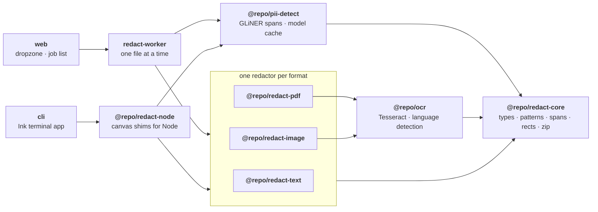

<div align="center">
  <picture>
    <source media="(prefers-color-scheme: dark)" srcset="./assets/localveil-logo-dark.svg">
    
  </picture>
  <br />
  <br />
</div>

localveil blacks out personal data in your files without uploading them. Drop in text, a PDF, or a photo of a document, and a named-entity model finds the names, emails, phone numbers, addresses, dates, account numbers and secrets, then paints over them. The model runs in a Web Worker on your own machine, the files never leave the tab, and the result comes back as a ZIP.

There is no account and no server. Once the model is cached, the page works offline. The same pipeline runs in a terminal through the CLI.

**At a glance**

- **What it is:** an app that redacts personal data from files locally, in the browser or the terminal.
- **What it takes:** plain text, Markdown, CSV, JSON, logs, PDFs, and images, in English, Portuguese or Spanish.
- **What it gives back:** the same files with the personal data covered, in a ZIP.
- **Where it runs:** entirely in the tab or in your shell. Nothing is uploaded, and the only network traffic is the one-time model download.

## Quickstart

```bash
pnpm install
pnpm dev --filter=web
```

Open `http://localhost:5173` and drop a file on the page.

The first run downloads the detection model, which is 894 MB in the browser and takes a while. It is fetched as six ranges at a time and each one is written to browser storage as it lands, so a refresh part way through picks up the ranges it is missing rather than starting again. Every run after that loads from cache in a few seconds.

For the terminal:

```bash
pnpm --filter cli start            # browse and pick files
pnpm --filter cli start scan.pdf   # or name them up front
pnpm --filter cli start --lang pt scan.pdf
```

The CLI writes `localveil.zip` into the working directory and keeps its copy of the model (349 MB) under `~/.cache/localveil/models`.

## What gets covered

The model tags eight kinds of personal data.

| Label             | Example                    |
| ----------------- | -------------------------- |
| `private_person`  | Maria Garcia               |
| `private_email`   | maria.garcia@example.com   |
| `private_phone`   | 555-0181                   |
| `private_address` | 42 Oak Street, Springfield |
| `private_date`    | 14 March 2024              |
| `private_url`     | a personal profile link    |
| `account_number`  | an IBAN or a card number   |
| `secret`          | an API key or password     |

Detection runs on `gliner_multi_pii-v1`, a GLiNER model whose training languages include Portuguese and whose label set was built for exactly this: CPF, CNPJ and driver's licence numbers are things it was trained to recognise, not things it has to guess at.

Below the model sits a pattern layer for numbers that carry their own arithmetic. CPF, CNPJ, IBAN and card numbers are matched and then verified by their check digits, so an invoice number that merely looks right is left alone. RG, CNH and CEP are matched beside the labels a Brazilian document prints next to them, with only the number covered and the label left readable. Dates in `dd/mm/yyyy` form are range-checked, phone shapes cover US and Brazilian conventions, and a span of years like 2019-2024 is recognised as not being a telephone.

A name the model tags once gets covered everywhere else it appears in the same document, including on pages it was never tagged on. A model that catches a full name in one sentence will often walk past the bare first name two lines down.

## Formats

| Input                                                      | How it is read                         | What comes back                                                                         |
| ---------------------------------------------------------- | -------------------------------------- | --------------------------------------------------------------------------------------- |
| `.txt` `.md` `.csv` `.json` `.log`                         | Read as text                           | The same file with covered runs replaced by `█`                                         |
| `.pdf`                                                     | Rendered, then recognised page by page | An image-per-page PDF with a searchable text layer rebuilt from the words that survived |
| `.png` `.jpg` `.webp` `.gif` `.bmp` `.tif` `.avif` `.heic` | Recognised with OCR                    | The same image with black rectangles painted on                                         |

A redacted PDF is rasterised rather than annotated. Drawing boxes over live text leaves the words in the file for anyone to copy out, which is not redaction. Rasterising costs the original text layer, so one is rebuilt from the recognised words that were not covered, and the output stays searchable.

## Privacy

- **Files stay in the tab:** the app reads them with `FileReader`, processes them in a Web Worker, and writes them back through `Blob`. No `fetch` anywhere touches them.
- **The only request is the model:** weights come from Hugging Face on first use and stay cached. After that the page works with the network off. When a release changes the model, the superseded weights are deleted from the cache rather than left to sit there.
- **Nothing is stored server-side** because there is no server. The app is a static bundle.
- **Language starts from the browser:** the interface follows `navigator.languages` across English, Portuguese and Spanish, and a picker in the corner overrides it. That choice is the only thing the app keeps in `localStorage`, and it is a language tag, not your data.

`vercel.json` sends `Cross-Origin-Opener-Policy: same-origin` and `Cross-Origin-Embedder-Policy: require-corp` so the page is cross-origin isolated, which is what lets ONNX Runtime use `SharedArrayBuffer` and multithreaded wasm. The dev server sends the same pair.

## Architecture



`@repo/redact-core` owns the shared vocabulary: what a span is, the checksum patterns, how spans become rectangles, and how the ZIP is built. Every redactor implements the same `Redactor` shape, so the worker resolves one from the file and knows nothing else about it. Adding a format means adding a package, not editing the worker. The CLI reuses the same redactors through `@repo/redact-node`, which supplies the canvas globals a browser would have provided.

## Packages

| Package              | Purpose                                                                                              |
| -------------------- | ---------------------------------------------------------------------------------------------------- |
| `@repo/redact-core`  | Types, checksum patterns, span merging, span-to-rectangle mapping, repeat matching, ZIP building.    |
| `@repo/pii-detect`   | GLiNER span detection over `gliner_multi_pii-v1`, the entity prompts, and the resumable model cache. |
| `@repo/ocr`          | Tesseract wrapper returning word boxes, plus stopword language detection across en / pt / es.        |
| `@repo/redact-text`  | Redactor for text formats. Masks with `█` and keeps line breaks intact.                              |
| `@repo/redact-pdf`   | Redactor for PDFs. Renders, recognises, paints, and rebuilds the document.                           |
| `@repo/redact-image` | Redactor for images. Recognises, paints, and re-encodes.                                             |
| `@repo/redact-node`  | Runs the redactors under Node: skia-backed canvas globals and file reading for the CLI.              |
| `@repo/i18n`         | Typed message catalogues for English, Portuguese and Spanish.                                        |
| `@repo/ui`           | Shared components: dropzone, progress, select, scroll area, button, card, toaster.                   |

The apps are `web`, the browser app, and `cli`, the Ink terminal app. `@repo/typescript-config` and `@repo/config-vitest` hold the shared tooling config.

## How a file is redacted

<details>
<summary><b>Text</b>: read, detect, mask</summary>

The file is read as a string, chunked by words with an overlap so an entity split across a boundary is still seen whole, and each chunk goes to the model. Spans come back as character ranges, get merged, and each covered grapheme becomes `█`, so an emoji or an accented letter takes one block rather than two.

Line breaks inside a covered range survive. A span that runs off the end of one line would otherwise weld two rows of a log or a CSV together.

</details>

<details>
<summary><b>PDF</b>: render, recognise, paint, rebuild</summary>

Each page is rendered at twice its point size onto an `OffscreenCanvas`, then recognised. Word boxes come from the recognised page rather than the PDF's own text layer: that layer gives runs, not words, and splitting a run's box by character count drifts by a whole character on a proportional font, which leaves the first letter of a name showing.

Every page is read before any page is painted, so a name that only gets tagged on the last page is still covered on the first. Pages are rendered a second time for painting rather than held in memory, because a hundred A4 canvases is most of a gigabyte.

The output embeds each painted page as an image and redraws the surviving words as invisible text, so the file stays searchable.

</details>

<details>
<summary><b>Images</b>: recognise, paint, re-encode</summary>

Recognition gives word boxes, those feed the same span-to-rectangle mapping the PDF path uses, and the rectangles get filled on a canvas. The result goes back out as the input's own type, or PNG for anything the encoder will not take.

</details>

<details>
<summary><b>Language</b>: detected, or told</summary>

A PDF with a usable text layer gets sampled directly, then recognised once in whatever language that text is written in. An image has no text until something reads it, so it goes through English first, the language comes from that pass, and a second pass runs only when the answer is not English.

Detection scores stopword frequency across the three supported languages, written without accents because the English probe drops most of them. The lists include the field labels identity documents print, because an ID card carries almost no prose to vote with: on a Brazilian licence, the evidence is words like `nome` and `filiação` and the `da` in the holder's name.

When you already know the answer, say so: the picker beside the dropzone and `--lang` on the CLI skip the guessing entirely, which matters most on exactly those documents.

</details>

<details>
<summary><b>Unreadable pages</b>: left alone, with a warning</summary>

A page whose fonts do not resolve renders as a wall of boxes. Recognisers read that as gibberish, and a detection model will confidently tag a long run of it as somebody's name, which paints a black rectangle over every line.

Under a confidence floor localveil looks for nothing. The page comes back untouched and carries a warning, so you can see it was unreadable and go and check it yourself.

</details>

## Stack

- **App:** React 19 + Vite 8, Tailwind CSS 4, shadcn-style components over Base UI, motion for the few animations, zustand for job state, sonner for toasts.
- **CLI:** Ink 7 with `@napi-rs/canvas` standing in for the browser's drawing surfaces.
- **Detection:** GLiNER (`gliner_multi_pii-v1`, ONNX) on ONNX Runtime: WebGPU with a wasm fallback in the browser, native CPU in the CLI. The tokenizer loads through `@huggingface/transformers`.
- **Documents:** `pdfjs-dist` for rendering, `pdf-lib` for rebuilding, `tesseract.js` for recognition, `fflate` for the ZIP.
- **Build:** Turborepo + pnpm workspaces.
- **Linting / formatting:** oxlint + oxfmt.
- **Testing:** Vitest, about 500 unit and component tests.

## Setup

### Prerequisites

- **Node.js 24** (`nvm install 24 && nvm use 24`)
- **pnpm 11** (`npm install -g pnpm@11`)

### 1. Install dependencies

```bash
pnpm install
```

### 2. Run the app

```bash
pnpm dev --filter=web
```

The dev server sends the cross-origin isolation headers the model needs, so run it through `pnpm dev` rather than serving `apps/web` some other way.

### 3. Try it

`fixtures/` holds one document per accepted format, each carrying the same invented people, so you can see what the output looks like without reaching for anything real.

## Scripts

| Command              | Description                                |
| -------------------- | ------------------------------------------ |
| `pnpm dev`           | Start the app in development mode.         |
| `pnpm build`         | Build every package and the app.           |
| `pnpm test`          | Run tests across the monorepo.             |
| `pnpm test:coverage` | Run tests with coverage.                   |
| `pnpm lint`          | Run oxlint.                                |
| `pnpm format`        | Format with oxfmt.                         |
| `pnpm format:check`  | Check formatting without writing.          |
| `pnpm typecheck`     | Run TypeScript checks across the monorepo. |
| `pnpm clean`         | Clean all build artifacts.                 |
| `pnpm fallow:dead`   | Find unused exports.                       |

## Limits

- **The model misses things.** It is a statistical tagger rather than a rule set, so it sometimes walks past a name it should have caught. Read the output before you send it anywhere.
- **Recognition sets the ceiling on scanned input.** A blurry photo or a PDF with broken fonts yields text nothing can redact, and the app says so rather than guessing.
- **A redacted PDF is images.** The text layer is rebuilt from recognised words, so it is searchable but not identical to the original, and the file is larger.
- **The first run is a large download.** 894 MB in the browser, 349 MB in the terminal, once, resumable, and fetched several ranges at a time. The browser carries the bigger 4-bit file because browser runtimes score the smaller 8-bit one wrongly; the CLI's native kernels do not have that problem.
