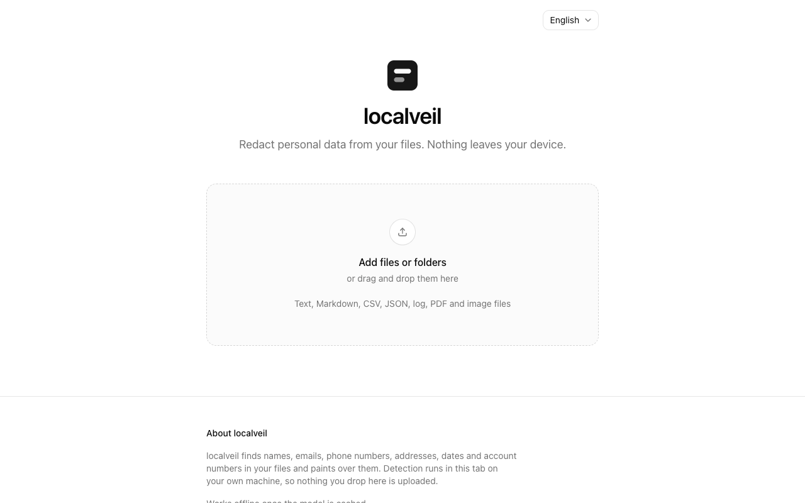
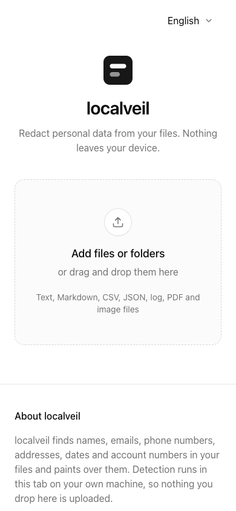
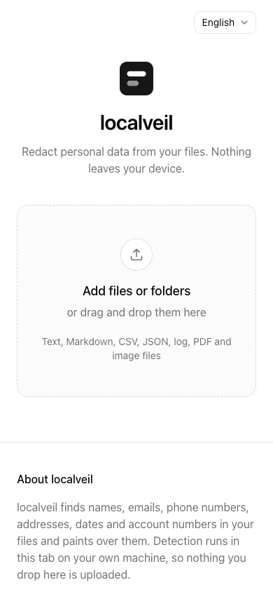

# shadcn visual comparison

Before: `8b78c96bd1f05df8cc2d9e679ee717b6b83bf28e` (PR merge base).

After UI source: `f2e2299fdb89ae9a5614a64dfeb91731cebcd07d`. Later commits in this PR only add review evidence.

The language selector gains the stock outlined appearance and is slightly shorter. The file dropzone and content retain their structure; the page shifts up slightly.

Manually compared matching desktop (1280×800) and mobile (390×844) viewports in Chromium, light theme, reduced motion. No horizontal overflow or unexpected clipping was observed in the sampled after states. This covers the pages/states below, not every screen, authenticated flow, or dark-mode state.

## Empty file workspace

App: `web`. Route: `/`. Same route and state on both commits.

Desktop

| Before                                  | After                                 |
| --------------------------------------- | ------------------------------------- |
|  |  |

Mobile

| Before                                 | After                                |
| -------------------------------------- | ------------------------------------ |
|  |  |
